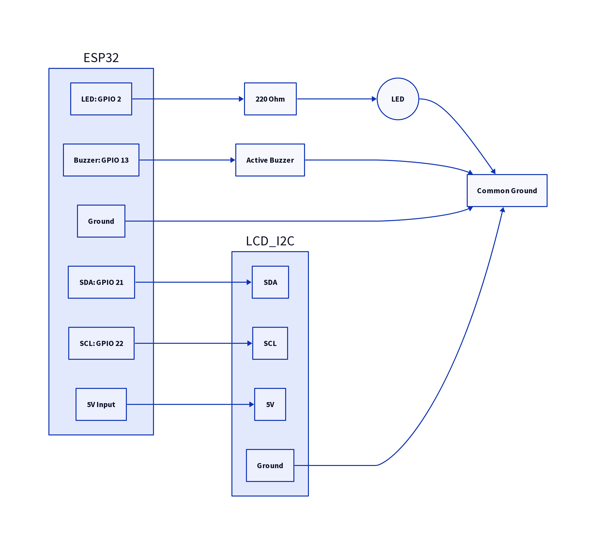
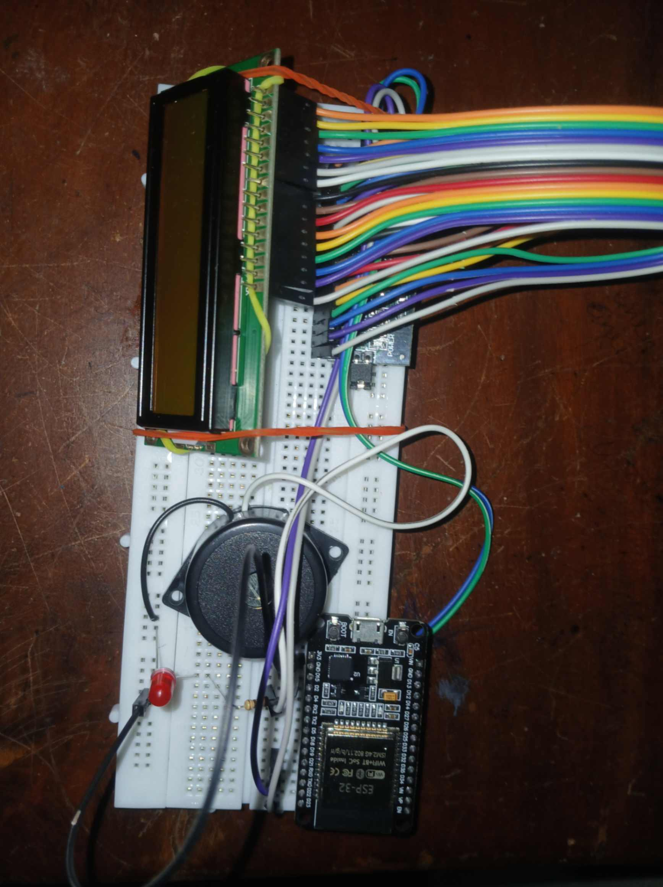
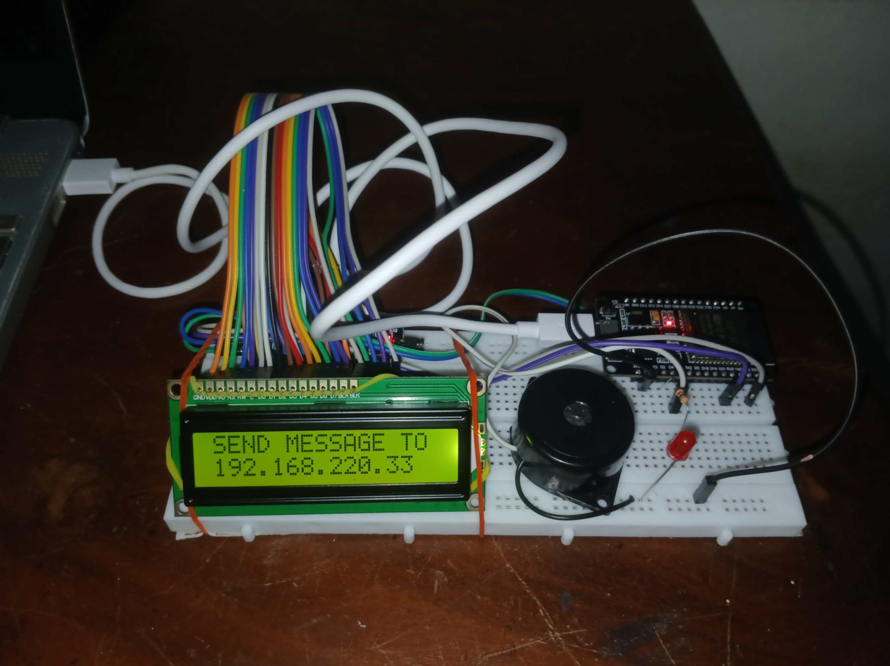
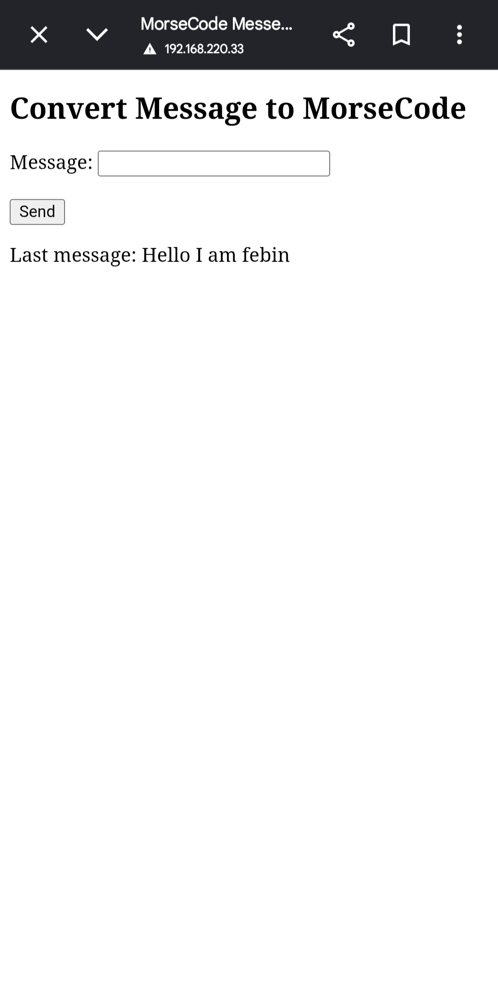

# ESP32-MorseCode-Converter

A wireless Morse code converter built with ESP32. The ESP32 hosts a local HTTP web server, allowing any device on the same Wi-Fi network to send text messages via a web interface. The message is converted to Morse code and displayed on an LCD, with optional audio beeps and LED visual effects.

## How it works
1. **Web Server**: ESP32 runs a HTTP server and serves a simple HTML form at its local IP address.
2. **Input**: Users enter text on the webpage from a phone, laptop, or PC on the same Wi-Fi.
3. **Conversion**: ESP32 converts the text to International Morse code.
4. **Output**: The Morse code is shown on an I2C LCD, with synchronized buzzer tones and LED blinks for audio/visual feedback.

## Features
- No external hosting needed - ESP32 acts as a standalone web server
- Real-time conversion and display
- Works with any device that has a browser
- Low-cost, easy to build with common ESP32 dev boards and I2C LCDs

## Hardware Used
- ESP32 DevKit v1
- 16x2 or 20x4 I2C LCD
- Buzzer 
- LED 

## Tech Stack
- Arduino framework / ESP-IDF
- WiFi.h, WebServer.h
- LiquidCrystal_I2C library

## Demonstration Video
[Click here to watch the demo video](https://drive.google.com/file/d/1D2UA1zOg4r4e_ophEM-e1r0I_9Zj-bEU/view?usp=sharing)

*The above link shows the demonstration of the working of the project*

## Project Images

*Circuit Diagram of the above project*

*Image showing actual Esp32 board and wiring on breadboard*

*Image shows the working of the project*

*Image shows the Web Page hosted by Esp32 to send text messages*
